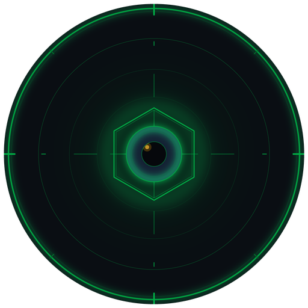
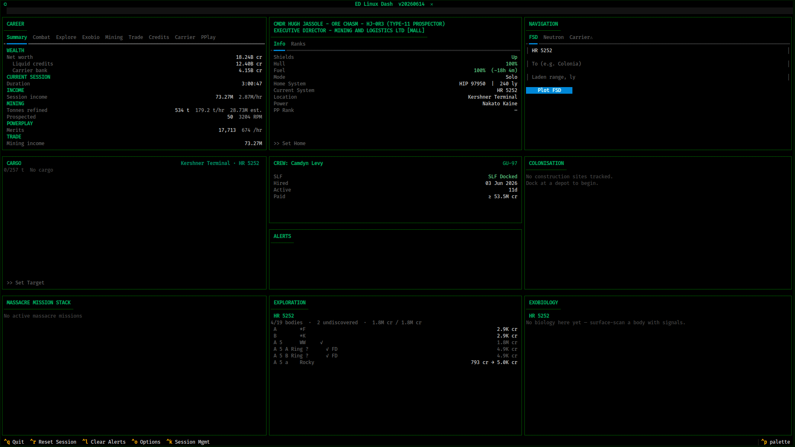
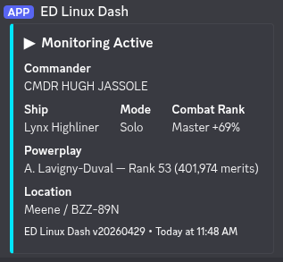

<div align="center">



# ED Linux Dash
**Commander monitoring dashboard for Elite Dangerous**

[](https://www.elitedangerous.com)
[]()
[](https://python.org)
[](https://github.com/Textualize/textual)
[]()

[](https://github.com/drworman/EDLD/releases)
[](https://github.com/drworman/EDLD/stargazers)
[](https://github.com/drworman/EDLD/network/members)
[](LICENSE)

<ins>Career & real-time session tracking</ins></br>
Combat · Trade · Mining · Exploration · Missions · Exobiology · PowerPlay · Assets, and more

<ins>Integrations</ins></br>
FDev CAPI · EDDN · EDSM · EDAstro · Inara · Raven Colonial · Discord Webhooks

<ins>Multiple Interface Options</ins></br>
Terminal scroll · Textual TUI

</div>

## Overview

EDLD is a CMDR career and real-time session monitoring dashboard for Elite Dangerous on Linux. It tails your journal and presents either a scrolling feed or a live Textual terminal dashboard alongside the game, tracking everything you do across combat, trade, mining, exploration, missions, exobiology, and PowerPlay.

Alerts fire when things go wrong: shields down, hull taking damage, fuel running low, fighter destroyed. Session statistics accumulate across all activity types in a tabbed panel that shows only what's relevant to your current session.

All game state flows through a unified `DataProvider` — CAPI when authenticated, journal events and local JSON files as fallback.

---

## Features

| | |
|--|--|
| 💥 **Combat Tracking** | Kills, bounties, combat bonds, deaths, and fighter losses with per-kill timing and faction tally |
| 🎯 **Mission Stack** | Active massacre mission tracking — stack value, completion status, and full bootstrap on start |
| 📊 **Session Statistics** | Tabbed activity dashboard — Combat, Trade, Mining, Exploration, Missions, Exobiology, PowerPlay — showing totals and /hr rates |
| 🖵 **Textual TUI** | Full terminal dashboard with all panels. Runs on any machine with Python and a modern terminal |
| 🛡️ **Combat Alerts** | Shield drops, hull damage, fighter loss, ship destruction. Auto-clear on login and docking, plus a manual clear button |
| ⛽ **Fuel Monitoring** | Warn and critical thresholds for fuel percentage and estimated time remaining |
| 🚨 **Security & Cargo Events** | Cargo scans, police scans, security attacks, low-value cargo notices |
| ⚠️ **Inactivity Warnings** | Alerts on kill rate drop or extended period without kills |
| ✕ **Session Management** | Optional, opt-in auto-quit of the game on configured triggers — SLF destroyed, low fuel, or low hull. **Solo mode only**; runtime toggle with Ctrl+K |
| 💵 **Lifetime Financial Ledger** | Journal-derived earnings and spending by category, voucher reconciliation (issued vs redeemed), and carrier-bank flow — built from 27 credit-moving event types because in-game Statistics fields like `Trading.Goods_Sold` are unreliable |
| 📦 **Cargo Block** | Live ship hold display with tonnage gauge, per-item list, stolen-goods flagging, and Spansh target-market price comparison |
| ⚗️ **Engineering Block** | Engineering materials inventory across Raw, Manufactured, and Encoded categories, plus Odyssey ShipLocker contents |
| 🚀 **Assets Block** | Full fleet overview — current ship, stored ships with loadouts, stored modules, fleet carrier status, wallet with At-Risk holdings and net worth |
| 🧑 **Commander Block** | Commander identity, squadron, home location, fuel, shields/hull, and adaptive display for SRV and on-foot states |
| 🪪 **Career Block** | Combat / Trade / Exploration / Mercenary / Exobiology rank progression with detail tabs |
| 👥 **Crew / SLF Block** | NPC crew roster and ship-launched fighter status with correct variant identification |
| 💰 **At-Risk Holdings Tracker** | Persistent cross-session tracker for unredeemed bounties, combat bonds, trade vouchers, cartography, and exobiology. Survives session resets, zeroed on death |
| 🛡️ **Unified Data Provider** | Single source of truth for all game state — CAPI › journal › Status.json |
| 🔐 **CAPI Authentication** | OAuth2 to Frontier's Companion API for authoritative fleet roster, market prices, fleet carrier finance, and squadron identity |
| 🌐 **Data Contributions** | Opt-in journal uploading to EDDN, EDSM, EDAstro, and Inara |
| 🏗️ **Colonisation Tracking** | Construction site resource requirements, delivery progress, and Raven Colonial integration (experimental) |
| 🎨 **Themes** | Eight built-in colour themes (default-orange, green, blue, purple, red, yellow, dark, light) plus a documented template for custom themes |
| 🔌 **Plugin Architecture** | Three-tier plugin loader with per-commander data isolation, named config profiles, plugins dialog with enable/disable controls, and a `plugins/` directory for user plugins |
| 📚 **Native Documentation Viewer** | In-app viewer for all bundled documentation |
| 🔍 **Search Modals** | Searchable pickers for home location and Spansh target market |
| 🔔 **Update Notifier** | Background check for new tagged releases on GitHub; notice surfaced in the terminal and the TUI |

<div align="center">

<br><em>Textual TUI — default theme, live session in progress</em>
</div>

---

## Installation

**→ Full instructions: [INSTALL.md](INSTALL.md)**

### Linux (Arch)
```bash
sudo pacman -S python-psutil
pip install discord-webhook cryptography --break-system-packages
./install.sh
```

### Linux (Debian / Ubuntu)
```bash
sudo apt install python3-psutil
pip install discord-webhook cryptography --break-system-packages
bash install.sh
```

### Linux (Fedora)
```bash
sudo dnf install python3-psutil
pip install discord-webhook cryptography --break-system-packages
bash install.sh
```

> `psutil` has C extensions requiring system libraries — install it via your distro's package manager, not pip. See [INSTALL.md](INSTALL.md) for details.

---

## Quick Start

```bash
git clone https://github.com/drworman/EDLD.git
cd EDLD
bash install.sh

./edld.py                    # Textual TUI dashboard (default)
./edld.py --mode terminal    # plain terminal output
./edld.py -p MyProfile       # named config profile
```

If no `config.toml` exists, EDLD creates one with defaults and prints its location on startup. Set `JournalFolder` to your ED journal directory before proceeding.

---

## Config file location

`config.toml` lives at `~/.local/share/EDLD/config.toml`. `~/.config/EDLD` is a symlink to the same directory.

---

## Discord Integration

1. In Discord: **Edit Channel → Integrations → Webhooks → New Webhook**
2. Copy the webhook URL into `config.toml`:

```toml
[Discord]
WebhookURL = 'https://discord.com/api/webhooks/...'
UserID = 123456789012345678
```

`UserID` enables `@mention` pings on level-3 alerts. Find yours via Discord's Developer Mode (right-click your username).

<div align="center">

<br><em>Startup embed posted to Discord when monitoring begins</em>
</div>

---

## Documentation

| Document | Contents |
|----------|----------|
| [CHANGELOG.md](CHANGELOG.md) | Version history |
| [INSTALL.md](INSTALL.md) | Full installation instructions |
| [Configuration](docs/CONFIGURATION.md) | All config keys, notification levels, CLI flags, profiles, data integrations (EDDN, EDSM, EDAstro, Inara, Raven Colonial) |
| [Terminal Output](docs/TERMINAL_OUTPUT.md) | Startup banner, event line format, sigil/tag reference, periodic summary |
| [Theming](docs/THEMING.md) | Built-in themes, custom theme creation |
| [Mission Bootstrap](docs/MISSION_BOOTSTRAP.md) | How EDLD reconstructs mission state on startup |
| [Roadmap](docs/ROADMAP.md) | Active, near-term, and deferred work |
| [Release Signing](docs/SIGNING.md) | How to verify release artifacts |

### Guides

| Guide | Description |
|-------|-------------|
| [Linux Setup](docs/guides/LINUX_SETUP.md) | Elite Dangerous on Linux with Steam, Proton, Minimal ED Launcher, and EDLD |
| [Dual Pilot](docs/guides/DUAL_PILOT.md) | Two accounts simultaneously with independent journals and tool instances |
| [Remote Access](docs/guides/REMOTE_ACCESS.md) | EDLD dashboard on a second machine as a thin client |
| [Session Management](docs/guides/SESSION_MANAGEMENT.md) | Optional Solo-only auto-quit on low fuel/hull or SLF loss — why it is Solo-only, how to enable and use it |

---

<div align="center">

*Fly safe out there, CMDR.*


**ED Linux Dash** · by CMDR CALURSUS

</div>
