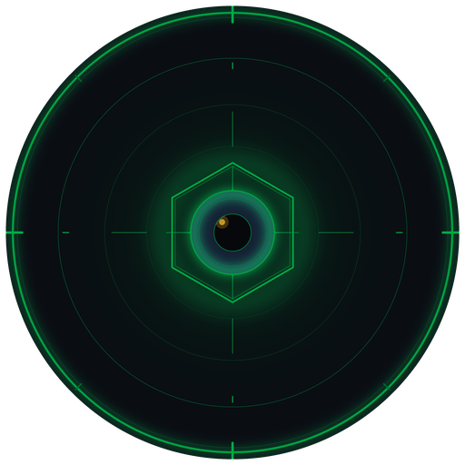
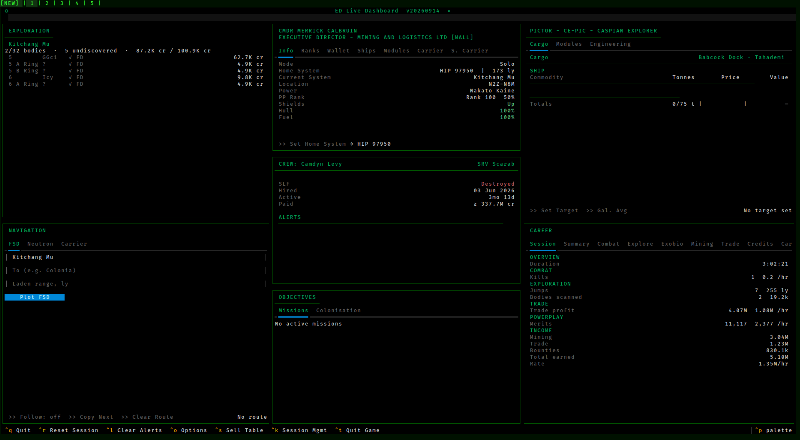
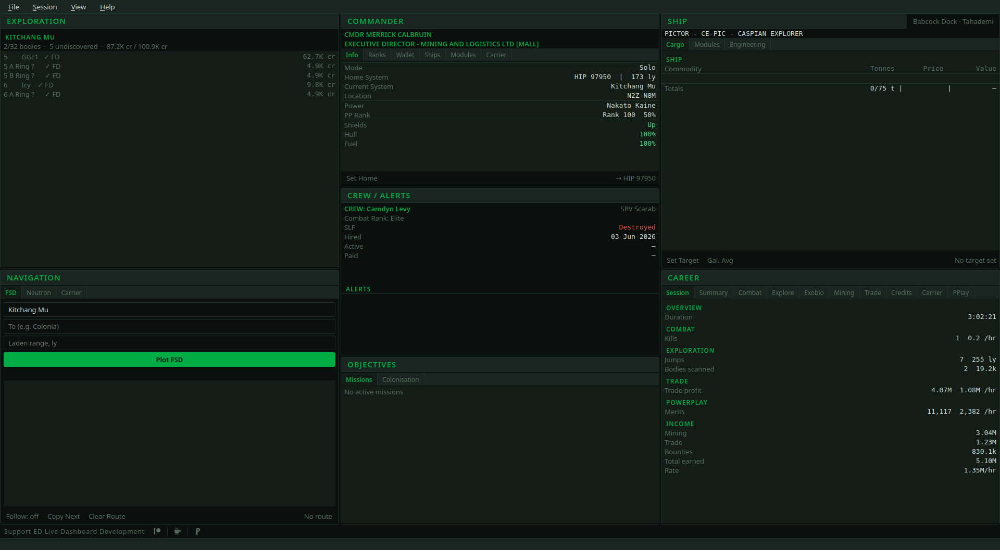
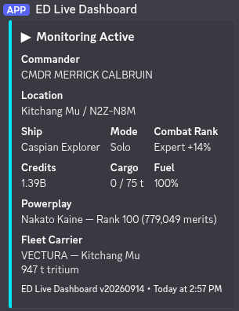

<div align="center">



# ED Live Dashboard
**Commander monitoring dashboard for Elite Dangerous**

[](https://www.elitedangerous.com)
[]()

[](https://github.com/drworman/EDLD/releases)
[](https://github.com/drworman/EDLD/stargazers)
[](https://github.com/drworman/EDLD/network/members)
[](LICENSE)

<ins>Career & real-time session tracking</ins></br>
Combat · Trade · Mining · Exploration · Missions · Exobiology · PowerPlay · Assets, and more

<ins>Integrations</ins></br>
FDev CAPI · EDDN · EDSM · EDAstro · Inara · Raven Colonial · Discord Webhooks

<ins>Multiple Interface Options</ins></br>
Terminal dashboard · Desktop window · Terminal scroll

</div>

## Overview

EDLD is a CMDR career and real-time session monitoring dashboard for Elite Dangerous, running on Linux, Windows and macOS. It tails your journal and presents the same dashboard three ways — a live terminal dashboard, a desktop window, or a scrolling feed — tracking everything you do across combat, trade, mining, exploration, missions, exobiology, and PowerPlay.

All three interfaces are built from one layout model and one set of components, so they show the same windows with the same data; only the rendering differs. Pick whichever suits the machine: the terminal dashboard over SSH, the desktop window on a second monitor beside the game.

Alerts fire when things go wrong: shields down, hull taking damage, fuel running low, fighter destroyed. Session statistics accumulate across all activity types in a tabbed panel that shows only what's relevant to your current session.

All game state flows through a unified `DataProvider` — CAPI when authenticated, journal events and local JSON files as fallback.

---

## Features

| | |
|--|--|
| 💥 **Combat Tracking** | Kills, bounties, combat bonds, deaths, and fighter losses with per-kill timing and faction tally |
| 🎯 **Objectives Window** | The mission board and colonisation in one place — every accepted mission grouped by type, the massacre stack summarised by source faction with its value and completion status, and construction sites with their outstanding requirements |
| 📊 **Session Statistics** | Tabbed activity dashboard — Combat, Trade, Mining, Exploration, Missions, Exobiology, PowerPlay — showing totals and /hr rates |
| 🖵 **Terminal Dashboard** | Full terminal dashboard with all panels. Runs on any machine with Python and a modern terminal |
| 🖥️ **Desktop Window** | The same dashboard as a native PySide6 window on Linux, Windows and macOS, with resizable columns, real menus, and full platform window controls |
| 🛡️ **Combat Alerts** | Shield drops, hull damage, fighter loss, ship destruction. Auto-clear on login and docking, plus a manual clear button |
| ⛽ **Fuel Monitoring** | Warn and critical thresholds for fuel percentage and estimated time remaining |
| 🚨 **Security & Cargo Events** | Cargo scans, police scans, security attacks, low-value cargo notices |
| ⚠️ **Inactivity Warnings** | Alerts on kill rate drop or extended period without kills |
| ✕ **Session Management** | Optional, opt-in auto-quit of the game on configured triggers — SLF destroyed, low fuel, or low hull. **Solo mode only**; runtime toggle with Ctrl+K |
| 💵 **Lifetime Financial Ledger** | Journal-derived earnings and spending by category, voucher reconciliation (issued vs redeemed), and carrier-bank flow — built from 27 credit-moving event types because in-game Statistics fields like `Trading.Goods_Sold` are unreliable |
| 📦 **Cargo** | The Ship window's first tab: the hold sorted cheapest-per-tonne first so the jettison candidate leads, under Commodity / Tonnes / Price / Value headings, followed live from `Cargo.json` so it stays right even when the journal lags. Stolen goods flagged, limpets set apart, Spansh target-market price comparison, and the SRV's tonnage alongside when one is out |
| 💱 **Sell Table** | Ctrl+S in either interface: what the market being quoted pays for every commodity, most valuable first, opening on a Mineable tab with All Items behind it. Written out alongside it as Markdown and HTML for use outside the app. Carrier markets are ignored throughout, and prices no NPC will honour are left out |
| 🗃️ **Commodity Catalogue** | Every commodity ever seen in `Market.json`, recorded once with its id, names and category, and re-recorded whenever its galactic average drifts. Market.json is overwritten on the next dock; this is not |
| ⚗️ **Engineering** | The Ship window's third tab: materials across Raw, Manufactured and Encoded categories, plus Odyssey ShipLocker contents |
| 🚀 **Assets Tabs** | Full fleet overview in the Commander window — wallet with At-Risk holdings and net worth, stored ships with loadouts, stored modules, and a tab each for a fleet carrier and a squadron carrier, shown only when you own one |
| 🧑 **Commander Window** | Identity, squadron, home location, PowerPlay standing and ship condition — hull, shields and fuel on the default Info tab — with rank progression and the full asset tabs alongside. Adapts to SRV, on-foot and fighter states |
| 🪪 **Career Block** | Combat / Trade / Exploration / Mercenary / Exobiology rank progression with detail tabs |
| 📊 **Session / Career Window** | This session's output on the first tab — what each activity produced, with every earning stream tallied in one Income section — then lifetime figures across Combat, Explore, Exobio, Mining, Trade, Credits, Carrier and PowerPlay. Reset the session with Ctrl+R |
| 📈 **Career Summary** | Lifetime headline figures from every Career tab in one place, built from the same shared model as the session view so both read identically at their own scope |
| 🔧 **Ship Window** | The vessel's name, ident and type heading three tabs — Cargo, Modules and Engineering. Modules are sorted by power priority then by health ascending, so anything needing repair surfaces first. Built for neutron hopping |
| 🔭 **Exploration Window** | Honk / scan / map state and each body's current and max-if-mapped cartographic value, with that body's exobiology — signals, sampled flora, clonal-distance aid and predicted genera — nested directly beneath it |
| 👥 **Crew / Alerts Window** | NPC crew roster and ship-launched fighter status with correct variant identification, sharing a window with the alert feed beneath it — the two are rarely busy at once. A Radio tab sits behind it, and any new alert brings Crew / Alerts back to the front |
| 📻 **Radio** | Radio Sidewinder, Hutton Orbital Radio and Radio Skvortsov in the Crew / Alerts window's Radio tab, in both interfaces — station list, play/stop, volume and mute, with the song title where the station sends one. Add, edit and delete stations from the tab itself (globally or for the current profile), or by hand in `[Radio]`. Never starts on its own |
| 💰 **At-Risk Holdings Tracker** | Persistent cross-session tracker for unredeemed bounties, combat bonds, trade vouchers, cartography, and exobiology. Survives session resets, zeroed on death |
| 🛡️ **Unified Data Provider** | Single source of truth for all game state — CAPI › journal › Status.json |
| 🔐 **CAPI Authentication** | OAuth2 to Frontier's Companion API for authoritative fleet roster, market prices, fleet carrier finance, and squadron identity |
| 🌐 **Data Contributions** | Opt-in journal uploading to EDDN, EDSM, EDAstro, and Inara |
| 🏗️ **Colonisation Tracking** | Construction site resource requirements, delivery progress, and Raven Colonial integration (experimental) — in the Objectives window's second tab |
| 🎨 **Themes** | Eight built-in colour themes (default-orange, green, blue, purple, red, yellow, dark, light) plus a documented template for custom themes — all render in both the terminal and desktop interfaces |
| 🔌 **Plugin Architecture** | Three-tier plugin loader with per-commander data isolation, named config profiles, plugins dialog with enable/disable controls, and a `plugins/` directory for user plugins |
| 📚 **Native Documentation Viewer** | In-app viewer for all bundled documentation |
| 🔍 **Search Modals** | Searchable pickers for home location and Spansh target market, in both interfaces |
| ⛏️ **Surface Mining Survey** | Planetary deposits recorded automatically as you work them — position joined from `Status.json`, because the game emits no event that carries one. Bodies surveyed from their DSS signal count, deposits confirmed by driving onto them, depletion kept as dated history rather than a deletion. Ctrl+D adds or edits the deposit underfoot, resolved by proximity |
| 🛰️ **Shared Survey Sheet** | Publish deposits to a Google Sheet and read back what other commanders found, so the compass points at sites you have never seen. Server-side deduplication on a stable deposit id, local observation always wins over the sheet, and a bad row is retired by flagging rather than deleting. Needs no Google Cloud project — a bound Apps Script, a URL and a token. An optional [dashboard template](sheets/README.md#the-dashboard) gives the sheet a filterable, sortable, HUD-themed view for those reading it rather than running EDLD (experimental) |
| 🎥 **Streamer Stats Overlay** | The subset of the dashboard worth putting on camera, drawn over the game itself. Three zones across the top plus docked columns down each side, panels contributed by the components that own the data, each choosing career figures, session figures, or career with the session in parentheses. Windows and X11 (experimental on Windows) |
| 🔔 **Update Notifier** | Background check for new tagged releases on GitHub; notice surfaced in the terminal, the TUI, and the desktop window |

<div align="center">

<br><em>Terminal Dashboard (<code>--tui</code>) — green theme, live session in progress</em>
<br>

<br><em>GUI Dashboard (<code>--gui</code>) — green theme, live session in progress</em>
</div>

---

## Installation

**→ Full instructions: [INSTALL.md](INSTALL.md)**

### Linux (Arch)
```bash
sudo pacman -S python-psutil
pip install discord-webhook textual miniaudio --break-system-packages
./install.sh
```

### Linux (Debian / Ubuntu)
```bash
sudo apt install python3-psutil
pip install discord-webhook textual miniaudio --break-system-packages
bash install.sh
```

### Linux (Fedora)
```bash
sudo dnf install python3-psutil
pip install discord-webhook textual miniaudio --break-system-packages
bash install.sh
```

> `psutil` has C extensions requiring system libraries — install it via your distro's package manager, not pip. See [INSTALL.md](INSTALL.md) for details.

The Streamer Stats Overlay needs a **running compositor** on Linux for
transparency — `picom` or equivalent. Window managers that do not composite,
i3 among them, do not start one. Without it the overlay paints an opaque panel
instead, which is readable but solid; EDLD detects which case applies and says
so in `--overlay-probe`. The overlay is supported on X11 and is experimental on
Windows; Wayland cannot host it at all, because a Wayland client cannot request
always-on-top or place itself absolutely.

`install.sh` offers to install PySide6 for the desktop interface. Decline it if
you only use the terminal interfaces — it is the largest dependency by far and
nothing else needs it. Set `EDLD_INSTALL_GUI=yes` or `=no` to answer ahead of
time in a scripted install.

### Windows and macOS

Download the binary for your platform from the
[Releases page](https://github.com/drworman/EDLD/releases) and run it. No Python
install is required; everything is bundled.

The Windows and macOS builds start the desktop window by default. The terminal
interfaces are still there if you run the executable from a shell with `--tui`
or `--terminal`, and `--selftest` reports whether each one loads.

Verify a download against the release's `.sha256` file — see
[docs/SIGNING.md](docs/SIGNING.md).

---

## Quick Start

```bash
git clone https://github.com/drworman/EDLD.git
cd EDLD
bash install.sh

./edld.py                    # terminal dashboard (default)
./edld.py --gui              # desktop window
./edld.py --terminal         # plain scrolling output
./edld.py -p MyProfile       # named config profile
./edld.py --selftest         # check both interfaces load
```

`--tui`, `--gui` and `--terminal` are the three interfaces. The older
`--mode textual|terminal|gui` form still works and means the same thing.

If no `config.toml` exists, EDLD creates one with defaults and prints its location on startup. Set `JournalFolder` to your ED journal directory before proceeding.

### Keys

The same bindings work in the terminal dashboard and the desktop window. The
desktop window carries all of them on its menus as well.

| Key | Action |
|-----|--------|
| `Ctrl+S` | Sell table — what this market pays, most valuable first. Press again or `Esc` to close |
| `Ctrl+O` | Preferences |
| `Ctrl+R` | Reset the session counters |
| `Ctrl+L` | Clear the alert feed |
| `Ctrl+K` | Arm or disarm session management ([guide](docs/guides/SESSION_MANAGEMENT.md)) |
| `Ctrl+T` | End the game session immediately |
| `Ctrl+D` | Add or edit the surface deposit you are parked on — which it is depends on where you are standing ([guide](docs/SURFACE_SURVEY.md)) |
| `Ctrl+G` | Push pending deposits to the shared survey sheet |
| `Ctrl+Q` | Quit EDLD |
| `F11` | Full screen (desktop window only) |

---

## Config file location

`config.toml` lives at `~/.local/share/EDLD/config.toml`. `~/.config/EDLD` is a symlink to the same directory.

---

## Discord Integration

1. In Discord: **Edit Channel → Integrations → Webhooks → New Webhook**
2. Copy the webhook URL into `config.toml`:

```toml
[Discord]
WebhookURL = 'https://discord.com/api/webhooks/...'
UserID = 123456789012345678
```

`UserID` enables `@mention` pings on level-3 alerts. Find yours via Discord's Developer Mode (right-click your username).

<div align="center">

<br><em>Startup embed posted to Discord when monitoring begins</em>
</div>

---

## Documentation

| Document | Contents |
|----------|----------|
| [CHANGELOG.md](CHANGELOG.md) | Version history |
| [INSTALL.md](INSTALL.md) | Full installation instructions |
| [Configuration](docs/CONFIGURATION.md) | All config keys, notification levels, CLI flags, profiles, data integrations (EDDN, EDSM, EDAstro, Inara, Raven Colonial) |
| [Terminal Output](docs/TERMINAL_OUTPUT.md) | Startup banner, event line format, sigil/tag reference, periodic summary |
| [Theming](docs/THEMING.md) | Built-in themes, custom theme creation |
| [Surface Mining Survey](docs/SURFACE_SURVEY.md) | Recording planetary deposits, the add/edit form, and sharing a survey with a squadron |
| [Survey Sheet Setup](sheets/README.md) | The Apps Script receiver, sharing access with a squadron, and the dashboard template |
| [Streamer Stats Overlay](docs/STREAMER_STATS_OVERLAY.md) | The in-game overlay: panels, placement, appearance, and diagnostics |
| [Mission Bootstrap](docs/MISSION_BOOTSTRAP.md) | How EDLD reconstructs mission state on startup |
| [Roadmap](docs/ROADMAP.md) | Active, near-term, and deferred work |
| [Release Signing](docs/SIGNING.md) | How to verify release artifacts |
| [Building](docs/BUILDING.md) | Running from source, building binaries, relinking against your own Qt |
| [Licensing](docs/LICENSING.md) | MIT, and how the LGPL obligations for Qt are met |

### Guides

| Guide | Description |
|-------|-------------|
| [Linux Setup](docs/guides/LINUX_SETUP.md) | Elite Dangerous on Linux with Steam, Proton, Minimal ED Launcher, and EDLD |
| [Dual Pilot](docs/guides/DUAL_PILOT.md) | Two accounts simultaneously with independent journals and tool instances |
| [Remote Access](docs/guides/REMOTE_ACCESS.md) | EDLD dashboard on a second machine as a thin client |
| [Session Management](docs/guides/SESSION_MANAGEMENT.md) | Optional Solo-only auto-quit on low fuel/hull or SLF loss — why it is Solo-only, how to enable and use it |

---

## License

EDLD is released under the [MIT License](LICENSE) — use it, fork it, sell it,
embed it in something proprietary. Keep the copyright notice.

Its dependencies carry their own terms. The one that constrains redistribution
is Qt: the desktop interface uses **PySide6 under the LGPL v3**, so a binary
you distribute must ship the licence texts and let recipients relink against
their own Qt. Both obligations are already met by the official builds.

| | |
|--|--|
| [LICENSE](LICENSE) | The MIT licence covering EDLD itself |
| [docs/LICENSING.md](docs/LICENSING.md) | How each LGPLv3 condition is met, and what to do if you fork and distribute binaries |
| [THIRD-PARTY-NOTICES.md](THIRD-PARTY-NOTICES.md) | Every dependency, its licence, and whether it is bundled |
| [licenses/](licenses/) | Full GPL and LGPL texts, shipped inside every binary and release archive |

The terminal interfaces depend only on permissively licensed packages; a build
carrying just `--tui` and `--terminal` has no LGPL obligations at all.

---

## Attribution and disclaimer

**ED Live Dashboard (EDLD) is an unofficial community tool.**

Elite Dangerous is a trademark of Frontier Developments plc. This project is
not affiliated with, endorsed by, or supported by Frontier Developments plc.
Please do not imply otherwise in a fork.

EDLD reads the journal files the game writes to your local filesystem, in the
documented format Frontier publishes for exactly this purpose. It does not
modify the game, inject code, or read process memory. Its only contact with
Frontier's servers is through the Companion API, using your own credentials and
only when you choose to connect.

---

<div align="center">

*Fly safe out there, CMDR.*


**ED Live Dashboard** · by CMDR MERRICK CALBRUIN

</div>
