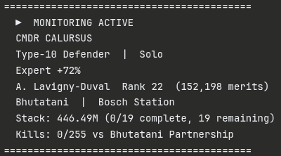

# EDLD Terminal Output Reference

---

## Startup Banner

On launch, EDLD preloads the current journal, bootstraps mission state, then prints a session summary:

```
==========================================
  ▶  MONITORING ACTIVE
  CMDR HUGH JASSOLE
  Type-10 Defender  |  Solo
  Expert +56%
  A. Lavigny-Duval  Rank 22  (152,198 merits)
  Bhutatani
  Stack: 386.32M (18/20 complete, 2 remaining)
==========================================
```

Conditional lines appear only when the relevant data is available:

| Line | Condition |
|------|-----------|
| Powerplay allegiance | Only when pledge is active |
| Location | Only when star system is known |
| Stack | Only when massacre missions are active |

<div align="center">

<br><em>Launch banner printed to terminal on startup</em>
</div>

---

## Event Lines

EDLD prints timestamped event lines to the terminal. Each line carries a fixed-width sigil indicating event category and urgency. When running the Textual dashboard, terminal output is suppressed and the dashboard's blocks receive the same events.

```
[14:23:07] *  KILL  Anaconda [Bhutatani Partnership] +4 [30.25M cr]
[14:31:44] *  MISS  Accepted massacre mission (active: 12)
[14:38:00] ~  SUMM  Session Summary: ...
[14:55:12] !! ATCK  Under attack by security services!
```

### Urgency Prefix

| Prefix | Meaning |
|--------|---------|
| `!! ` | Critical — immediate threat or loss |
| `!  ` | Warning — degraded state or alert |
| `*  ` | Active event — kill, mission change |
| `^  ` | Damage / defensive event |
| `+  ` | Gain — reward, merit, fuel |
| `~  ` | Summary / periodic report |
| `-  ` | Status / informational |
| `>  ` | Navigation / movement |

### Category Tag

| Tag | Event type |
|-----|-----------|
| `KILL` | Bounty or faction kill bond awarded |
| `MISS` | Mission accepted, loaded, completed, or abandoned |
| `SUMM` | Session summary (periodic or on demand) |
| `ATCK` | Under attack by security services |
| `WARN` | Inactivity or kill rate alert |
| `SCAN` | Cargo scan, security scan, or outbound scan |
| `SHLD` | Shield state change |
| `HULL` | Ship hull damage |
| `DEAD` | Ship or fighter destroyed |
| `SLF ` | Fighter launched, damaged, or destroyed |
| `FUEL` | Fuel level notification |
| `MERC` | Powerplay merits earned |
| `SHIP` | Ship loadout change |
| `INFO` | Session start, CMDR info, menu/quit events |
| `JUMP` | Supercruise entry or FSD jump |
| `DROP` | Dropped at destination (RES or CZ) |

---

## Periodic Summary

Posted at :00, :15, :30, and :45 of every hour while at least one activity provider reports data — to the terminal / dashboard and optionally to Discord:

```
Session Summary
Duration:          2:14:33
  Combat
    Kills:              67  |  29.9 /hr
    Bounties:        5.61M  |  2.50M /hr
  Exploration
    Distance:       7 jumps  |  175 ly
    Bodies scanned:     16  |  2.36M
  Missions
    Completed:           3  |  397.6k credits
  PowerPlay
    Merits:          1,072  |  478 /hr
```

Values right-align and the `|` delimiter is column-aligned across all rows. Each section appears only when that activity type has data for the current session. Summaries accumulate across the full session — each one shows the running total, not just the last interval.

The summary fires on the first qualifying quarter-hour tick after EDLD starts, then repeats on every subsequent :00/:15/:30/:45 boundary.
